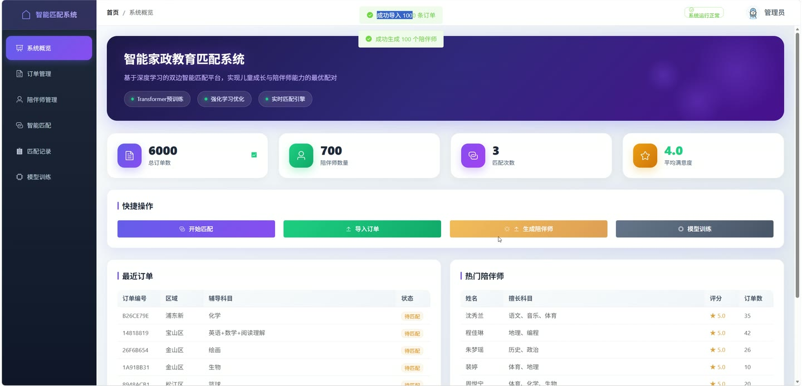
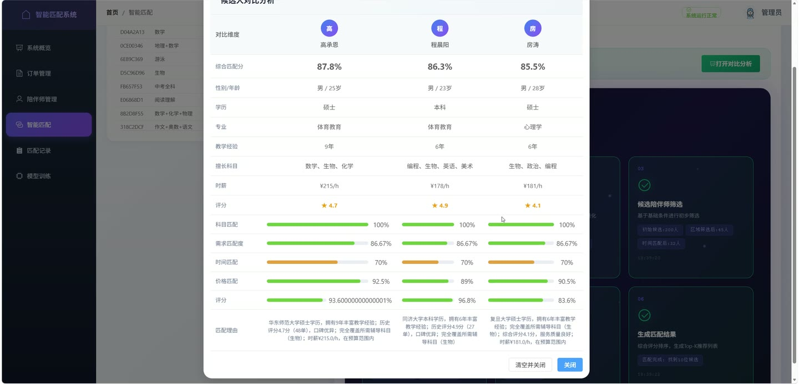
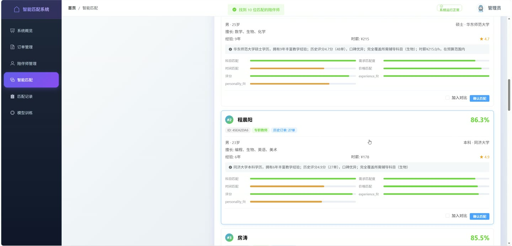
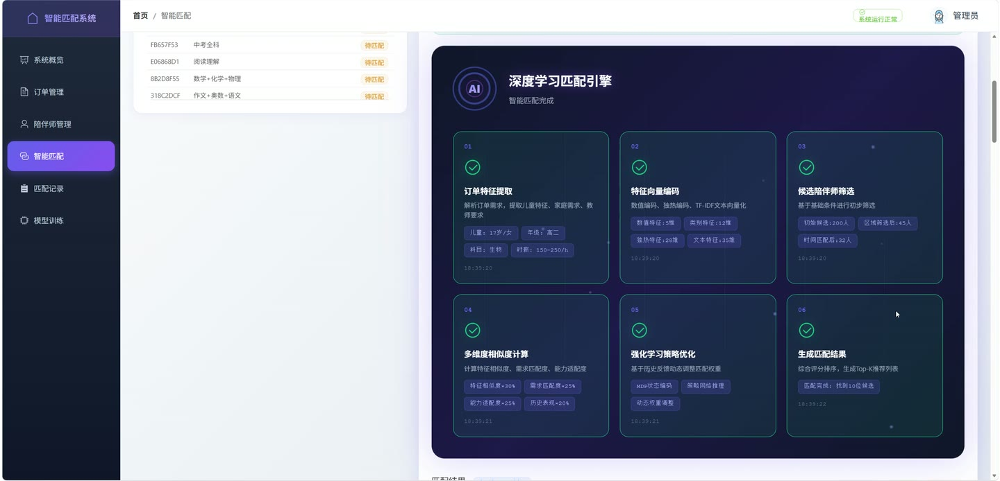
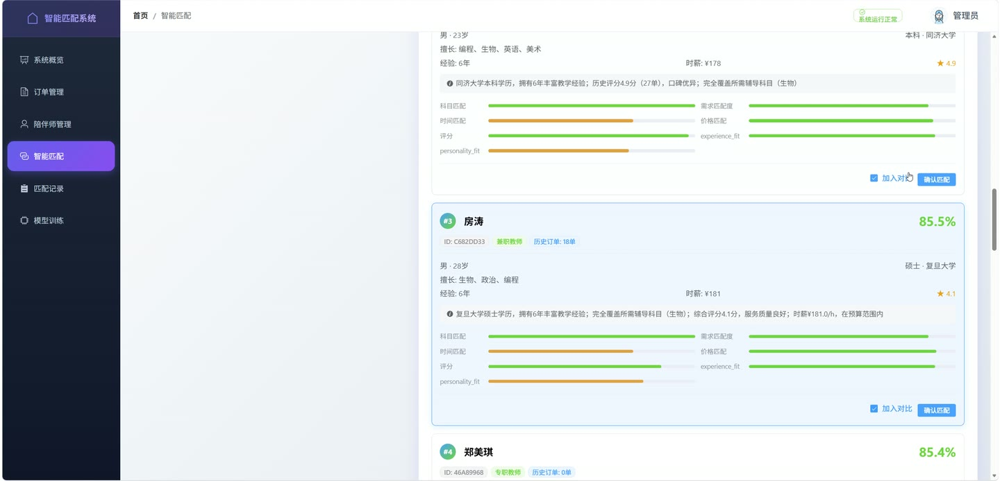

# (附文档)Python+FastAPI+PyTorch 家政教育双边匹配系统

**技术栈**：Python、FastAPI、PyTorch、深度学习、Vue3

### 系统简介

本系统是一套面向家政教育场景的双边智能匹配平台，采用前后端分离架构，后端基于 FastAPI 提供 REST 接口，前端基于 Vue3 + Element Plus 构建管理后台。系统围绕家庭需求订单与陪伴师资源，提供订单管理、陪伴师管理、深度学习智能匹配、匹配记录与反馈、模型训练等能力，主要角色为管理员端。
 
### 核心功能
 
### 管理员端

 
- 系统概览：展示总订单数、陪伴师数量、匹配次数、平均满意度四项统计卡片，并列出最近订单、热门陪伴师与模型状态。 
- 快捷操作：一键跳转智能匹配、导入订单、生成陪伴师、进入模型训练四个入口。 
- 订单列表：分页查询订单，支持按匹配状态（待匹配/已匹配）筛选，展示订单编号、区域、儿童信息、辅导科目、服务类型、时薪范围、学历要求、紧急程度与状态。 
- 新建订单：填写区域、地址、儿童年龄/性别/年级/学段/性格/学习风格、服务类型、辅导科目、时薪范围、教师类型/学历/性别要求等完整字段创建订单。 
- 订单详情：查看订单全部字段，包括儿童兴趣爱好、薄弱科目、课程频次、单次时长、预算灵活度、特殊要求等。 
- 订单匹配跳转：对待匹配订单可直接跳转至智能匹配页并带入订单 ID。 
- 陪伴师列表：分页查询陪伴师，展示姓名、擅长科目、评分、订单数等，支持按是否活跃筛选。 
- 陪伴师详情：查看陪伴师性别、年龄、学历、院校、专业、教学经验、证书、性格、沟通风格、可服务时间、时薪、服务区域、陪伴师类型等。 
- 智能匹配：选择订单后设置特征相似度、需求匹配度、能力适配度、历史表现四项权重，选择 Top 3/5/10 候选数量发起匹配。 
- 匹配结果展示：展示每位候选人的匹配分数、匹配理由、各维度得分、性别年龄学历院校、擅长科目、经验、时薪、评分。 
- 候选人对比：勾选至少两位候选人后打开对比分析，按综合匹配分、性别年龄等维度逐项对照。 
- 确认匹配：对选中的候选人执行确认匹配，生成匹配记录。 
- 匹配记录列表：按状态（待确认/进行中/已完成/已拒绝）筛选匹配记录，展示匹配编号、订单 ID、陪伴师 ID、匹配分数、匹配理由、匹配时间与状态。 
- 提交服务反馈：按周次提交总体评分、教学效果、沟通能力、准时性、服务态度，以及成绩变化、兴趣培养、性格改善、文字评价与是否继续服务。 
- 获取强化学习建议：对进行中的匹配记录获取强化学习模型给出的调整动作与说明。 
- 匹配记录详情：查看匹配编号、匹配时间、订单与陪伴师 ID、匹配分数、状态、匹配理由、确认时间与完成时间。 
- 模型训练：一键在后台启动模型训练任务，训练数据来源于 Excel 数据集。 
- 模型状态查看：查看预训练模型是否加载、强化学习模型是否加载、模型版本与最后训练时间。 
- 数据初始化：从 Excel 批量导入订单数据，并可批量生成模拟陪伴师数据（1 至 500 位可选）。
 
### 技术栈

 后端框架Python + FastAPI ORM / 数据库访问SQLAlchemy AsyncSession（异步会话） 数据校验Pydantic（OrderCreate、TutorCreate、MatchRequest、FeedbackCreate 等模型） 深度学习PyTorch（无监督预训练 + 强化学习） 数据处理Pandas（Excel 数据加载与清洗） 前端框架Vue3 + Element Plus 前端路由Vue Router（createWebHistory） 构建工具Vite 接口风格RESTful API，统一 API_PREFIX 前缀，支持 CORS 后台任务FastAPI BackgroundTasks（模型训练异步执行）
 
### 交付内容

 
- 后端完整源码 
- 前端完整源码 
- 数据库初始化脚本 
- 万字文档

## 界面展示

---

## 获取完整源码 + 万字文档

本仓库为项目介绍页。**完整前后端源码、数据库初始化脚本、万字项目文档**，请加微信 `kangkangcode`，或访问 [codekk.top](http://codekk.top) 获取。

可作课程设计 / 毕业设计参考，支持远程部署调试。